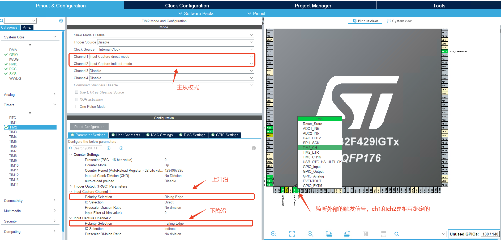

# 嵌入式Tim的学习记录

### 1.目的:学习stm32F429的外部时钟。

主要是学习主从模式，通过不同的通道计数，通过不同的寄存器计数，通过高低电平触发的时间差值，
计算距离等其他方面的应用  
由于没有雷达，采用模拟方式，如下图所示：PH2，PH3默认为按键触发引脚，添加(Exit)中断触发,类似于
开始读取实验，PA4外接PA5，程序通过控制PA4的高低电平，从而控制PA5的输入电平，从而计算出距离。


### 2.初始化工作：如上图所示配置芯片的初始化

工程中的函数解释:HAL_TIM_IC_Start

```c++
MX_TIM2_Init();
HAL_TIM_IC_Start(&htim2, TIM_CHANNEL_1);
HAL_TIM_IC_Start_IT(&htim2, TIM_CHANNEL_2);
```

| 作用与特点                |    模式 |                       函数名称                       |
|----------------------|------:|:------------------------------------------------:|
| HAL_TIM_IC_Start     |  轮询模式 |                纯硬件捕获，CPU需要手动去读取数据                |
| HAL_TIM_IC_Start_IT  |  中断模式 | 每次捕捉到信号后，都会进入一次中断,中断函数HAL_TIM_IC_CaptureCallback |
| HAL_TIM_IC_Start_DMA | DMA模式 |          捕获到信号后，会将数据存储到指定的内存地址中,无需CPU参与          |

上述代码开启了TIM2的通道1和通道2的输入捕获功能，通道1用于轮询模式，通道2用于中断模式。  
按键控制触发

```c++
void HAL_GPIO_EXTI_Callback(uint16_t GPIO_Pin) {
    // 简单的软件防抖：延迟一小段时间后再读取引脚状态
    static uint32_t last_interrupt_time_pin2 = 0;
    static uint32_t last_interrupt_time_pin3 = 0;
    uint32_t        current_time             = HAL_GetTick();

    if (GPIO_Pin == GPIO_PIN_2) {
        // 防抖：如果距离上次中断小于50ms，忽略
        if (current_time - last_interrupt_time_pin2 > 50) {
            // 检测下降沿（按键按下）
            if (HAL_GPIO_ReadPin(GPIOH, GPIO_PIN_2) == GPIO_PIN_SET) {
                is_rising = true;
            }
            last_interrupt_time_pin2 = current_time;
        }
    } else if (GPIO_Pin == GPIO_PIN_3) {
        // 防抖：如果距离上次中断小于50ms，忽略
        if (current_time - last_interrupt_time_pin3 > 50) {
            // 检测下降沿（按键按下）
            if (HAL_GPIO_ReadPin(GPIOH, GPIO_PIN_3) == GPIO_PIN_SET) {
                is_rising = false;
            }
            last_interrupt_time_pin3 = current_time;
        }
    }
}
```

PA5 Channel2接受到信息，触发的中断

```c++
void HAL_TIM_IC_CaptureCallback(TIM_HandleTypeDef *htim) {
    if (htim == &htim2) {
        if (htim->Channel == HAL_TIM_ACTIVE_CHANNEL_2) {
            // 读取捕获值
            uint32_t rising_time  = HAL_TIM_ReadCapturedValue(htim, TIM_CHANNEL_1);  // 上升沿时间
            uint32_t falling_time = HAL_TIM_ReadCapturedValue(htim, TIM_CHANNEL_2); // 下降沿时间

            // 计算脉冲宽度（考虑定时器溢出的情况）
            uint32_t pulse_width;
            if (falling_time >= rising_time) {
                pulse_width = falling_time - rising_time;
            } else {
                // 定时器溢出的情况
                pulse_width = (0xFFFFFFFF - rising_time) + falling_time + 1;
            }

            // 计算距离（假设是超声波传感器，声速340m/s）
            // 距离(cm) = 脉冲宽度(us) * 声速(cm/us) / 2
            // 假设定时器频率为84MHz，则1个计数 = 1/84 us
            float distance_cm = (pulse_width / 84.0f) * 0.034f / 2.0f;
            memset(message, 0, sizeof(message));
            sprintf(message, "Rising: %lu, Falling: %lu, Width: %lu, Dist: %.2f cm\n",
                    rising_time, falling_time, pulse_width, distance_cm);
            HAL_UART_Transmit(&huart2, (uint8_t *) message, strlen(message), HAL_MAX_DELAY);
        }
    }
}
```

模拟触发函数

```c++
    while (1) {
        /* USER CODE END WHILE */
        if (is_rising) {
            __HAL_TIM_SET_COUNTER(&htim2, 0);
            HAL_GPIO_WritePin(GPIOA, GPIO_PIN_4, GPIO_PIN_SET);
            HAL_Delay(20);
            HAL_GPIO_WritePin(GPIOA, GPIO_PIN_4, GPIO_PIN_RESET);
        }
        /* USER CODE BEGIN 3 */
    }
```

学习总结:  
1.了解Tim的主从模式，避免用单一寄存器去取值，可能造成数据读取错误  
2.学习Tim的主从模式，学习如何配置stm32CubeMX的时钟  
3.api函数的学习，例如HAL_TIM_IC_Start启动通道的定时器，HAL_TIM_IC_Start_IT启动通道定时器
并且触发中断  
4.HAL_TIM_ReadCapturedValue读取寄存器中的数值  
5.上述代码有错误，触发中断和while(1){}中的清除寄存器中的数值有冲突，应该在while(1){}中添加
__HAL_TIM_SET_COUNTER(&htim2, 0);
