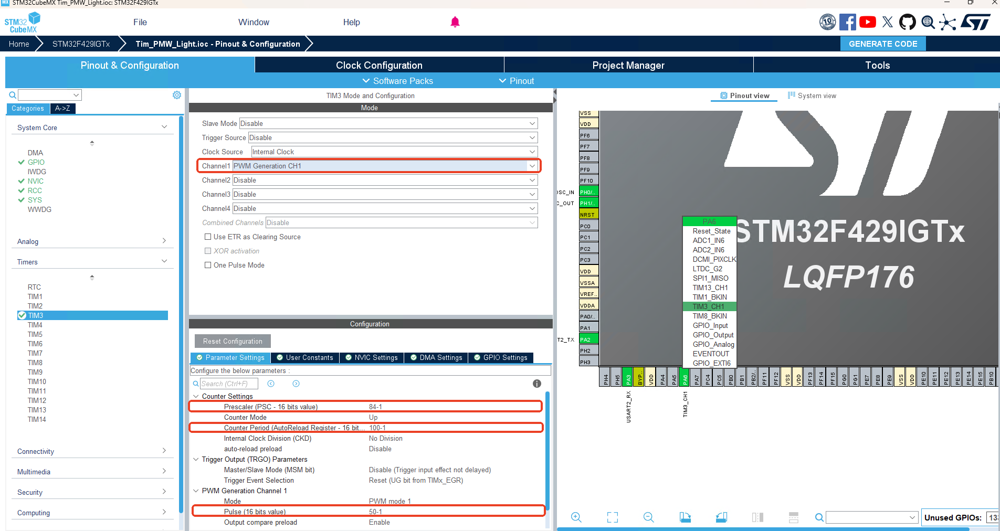

## 定时器PWM

### 学习目标:

1. 了解定时器PWM的原理
2. 了解定时器PWM的配置步骤
3. 了解定时器PWM的使用方法
4. 了解定时器PWM的注意事项
5. 了解定时器PWM的常见问题及解决方法
6. 了解定时器PWM的实例应用

### 学习内容:（来自chatgpt描述）

### 1.PWM的原理:定时器计数 + 比较器 + 输出翻转逻辑

定时器计数到设置的目标数值，输出翻转，生成PWM波形

#### 1.定时器

PSC 预分频器，设置定时器的时钟频率  
ARR 自动重装寄存器，设置定时器的周期  
CR1 控制寄存器1，设置定时器的模式，如向上计数、向下计数等  
SR 状态寄存器，读取定时器的状态，如更新完成、计数溢出等

##### 定时器PWM的原理:

通过设置的Pulse值的大小，比较定时器的计数值，当计数值小于Pulse值时，输出高电平，当计数值大于Pulse值时，输出低电平，从而实现PWM波形的生成
占空比:Pulse/ARR
通过控制Pulse的大小，实现占空比的控制，从而实现对LED亮度的控制

#### 2.PMW在STM32CubeMX的配置截图



#### 3.定时器的实例应用

```c++
int main(void) {
    HAL_Init();
    SystemClock_Config();
    MX_GPIO_Init();
    MX_TIM3_Init();
    MX_USART2_UART_Init();
    /* 启动定时器3的PWM输出 */
    HAL_TIM_PWM_Start(&htim3, TIM_CHANNEL_1);
    /* USER CODE END 2 */

    /* Infinite loop */
    /* USER CODE BEGIN WHILE */
    while (1) {
        /* USER CODE END WHILE */
        for (int i = 0; i < 100; i += 1) {
            __HAL_TIM_SET_COMPARE(&htim3, TIM_CHANNEL_1, i);
            HAL_Delay(10);
        }
        /* USER CODE BEGIN 3 */
    }
    /* USER CODE END 3 */
}

```

